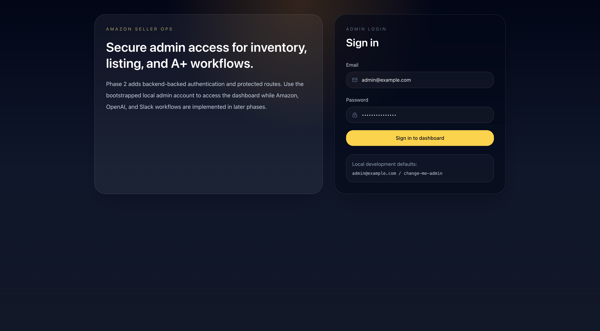
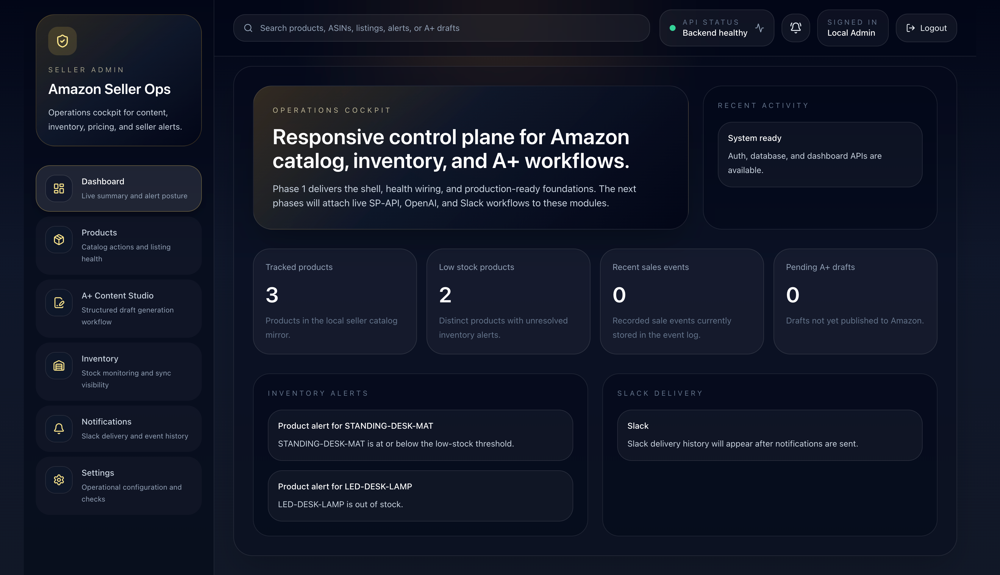
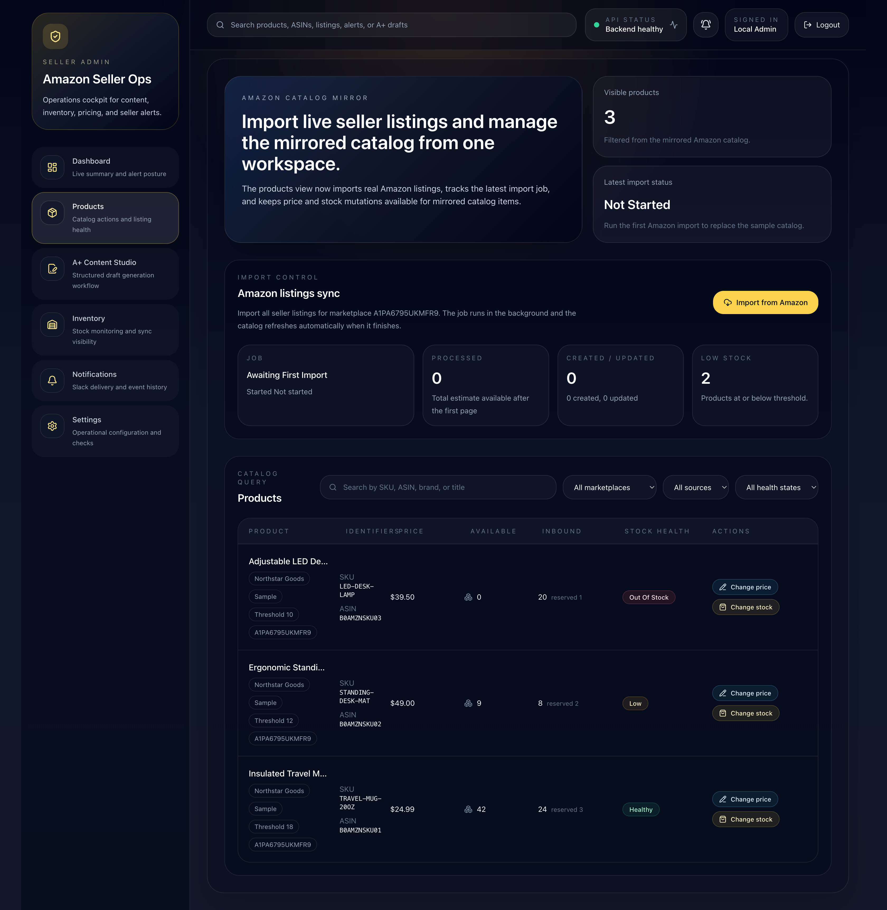
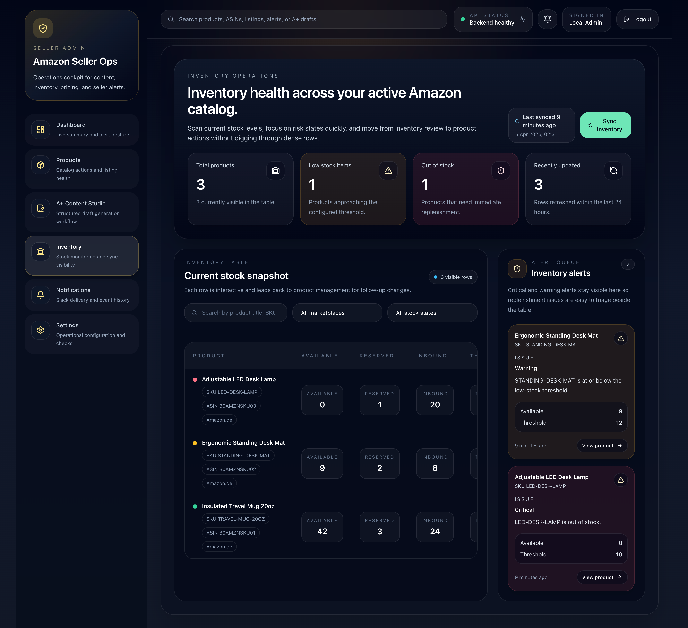
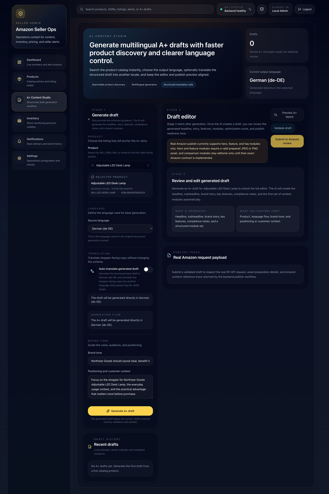
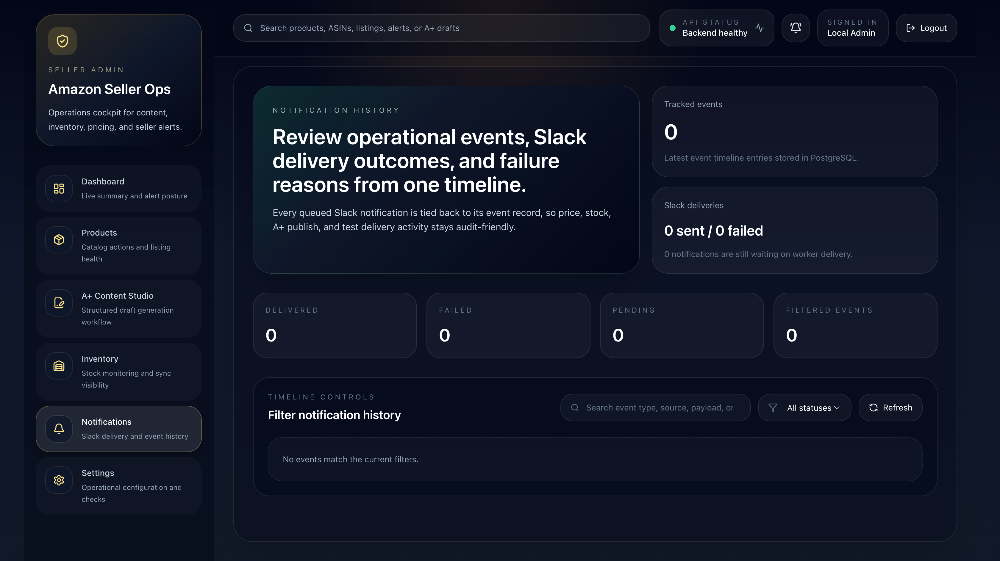
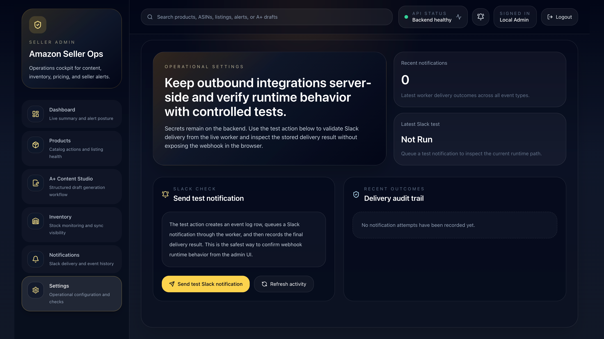

# Amazon Seller Ops

Amazon Seller Ops is a production-minded Amazon seller operations dashboard and Amazon SP-API admin platform. It combines catalog import, inventory monitoring, listing mutations, A+ content generation, AI-assisted content workflows, Slack notifications, and an operational web dashboard into one system.

It is designed as a portfolio-grade full-stack project that demonstrates marketplace operations tooling, async workflows, third-party integrations, and modern admin UX for Amazon seller teams.

## What This Project Demonstrates

- full-stack product architecture across React, FastAPI, PostgreSQL, Redis, and Docker
- async workflows for notifications, background processing, and publish lifecycle handling
- third-party integrations with Amazon SP-API, OpenAI, and Slack
- AI-assisted A+ content generation, improvement, image workflows, and publish preparation
- operational dashboard UX for seller catalog, inventory, pricing, stock, and content operations

## Screenshots

### Login


### Dashboard


### Products


### Inventory


### A+ Content Studio


### Notifications


### Settings


## Features

- Amazon SP-API catalog import for real seller listings
- inventory monitoring with low-stock detection and sync workflows
- price and stock update workflows with audit logging
- OpenAI-backed A+ draft generation with multilingual support
- targeted A+ draft improvement flows based on optimization scores
- A+ image workflows for uploaded, generated, and reusable assets
- Amazon A+ publish preparation and supported live publish subset
- Slack operational notifications with structured Block Kit messages
- responsive admin UI for dashboard, products, inventory, A+ Studio, notifications, and settings

## Current Product Areas

- `/`
  dashboard summary
- `/products`
  product catalog, search, mutations, and Amazon import controls
- `/inventory`
  inventory visibility, sync, alerts, and stock health
- `/aplus`
  A+ Studio for generation, editing, optimization, preview, and publish flow
- `/notifications`
  notification history and Slack delivery visibility
- `/settings`
  environment and integration-related controls

## Tech Stack

### Backend
- FastAPI
- SQLAlchemy
- PostgreSQL
- Redis
- Dramatiq
- OpenAI API
- Amazon Selling Partner API

### Frontend
- React
- TypeScript
- Vite
- Tailwind CSS
- Lucide React

### Infra
- Docker Compose
- Nginx

## Project Structure

```text
amazon-spi/
├── backend/                # FastAPI app, workers, tests, migrations
├── frontend/               # React + Vite admin UI
├── nginx/                  # Reverse proxy configuration
├── docs/                   # Runbooks, screenshots, review notes
├── infra/                  # Reserved for future infrastructure assets
├── .env.example
├── docker-compose.yml
└── README.md
```

## Quick Start

### 1. Clone the repository

```bash
git clone https://github.com/yakupbulbul/amazon-spi-ops.git
cd amazon-spi-ops
```

### 2. Create your environment file

```bash
cp .env.example .env
```

### 3. Start the full stack with Docker

```bash
docker compose up --build -d
```

### 4. Open the app

- [http://127.0.0.1:8080](http://127.0.0.1:8080)

Then sign in with the admin credentials configured in your local `.env`.

## Docker Services

Defined in [docker-compose.yml](docker-compose.yml):

- `postgres`
- `redis`
- `backend`
- `worker`
- `frontend`
- `nginx`

Useful commands:

```bash
docker compose ps
docker compose logs -f backend
docker compose logs -f worker
docker compose down
```

## Environment Variables

Create `.env` from `.env.example` and set the values you need.

Core application values:

- `SECRET_KEY`
- `APP_ENV`
- `NGINX_PORT`
- `DATABASE_URL`
- `REDIS_URL`

OpenAI integration:

- `OPENAI_API_KEY`
- `OPENAI_MODEL`
- `OPENAI_IMAGE_MODEL`

Amazon SP-API integration:

- `LWA_CLIENT_ID`
- `LWA_CLIENT_SECRET`
- `LWA_REFRESH_TOKEN`
- `AWS_ACCESS_KEY_ID`
- `AWS_SECRET_ACCESS_KEY`
- `MARKETPLACE_ID`
- `SELLER_ID`

A+ publish controls:

- `APLUS_LIVE_PUBLISH_ENABLED`
- `APLUS_UPLOAD_MAX_BYTES`

Slack integration:

- `SLACK_WEBHOOK_URL`

## Local Development

### Backend

```bash
cd backend
python3.11 -m venv .venv
source .venv/bin/activate
pip install --upgrade pip
pip install -e ".[dev]"
uvicorn app.main:app --reload --host 0.0.0.0 --port 8000
```

### Frontend

```bash
cd frontend
npm install
npm run dev -- --host 0.0.0.0 --port 5173
```

The Vite dev server proxies `/api` to `http://localhost:8000` by default.

## Key API Routes

- `GET /api/health`
- `GET /api/health/ready`
- `POST /api/auth/login`
- `GET /api/auth/me`
- `GET /api/dashboard/summary`
- `GET /api/products`
- `POST /api/products/import`
- `GET /api/products/import-jobs/latest`
- `PATCH /api/products/{id}/price`
- `PATCH /api/products/{id}/stock`
- `GET /api/inventory`
- `GET /api/inventory/alerts`
- `POST /api/inventory/sync`
- `GET /api/aplus/drafts`
- `POST /api/aplus/generate`
- `POST /api/aplus/validate`
- `POST /api/aplus/publish`
- `GET /api/events`
- `POST /api/notifications/slack/test`
- `POST /api/notifications/orders/test`

## Amazon A+ Support

Current real publish subset:

- `hero` -> `STANDARD_HEADER_IMAGE_TEXT`
- `feature` -> `STANDARD_SINGLE_IMAGE_HIGHLIGHTS`
- `faq` -> `STANDARD_TEXT`

Not yet supported for real Amazon publish:

- `comparison`

The A+ Studio currently supports:

- multilingual draft generation
- source/translated draft variants
- optimization scoring
- targeted rewrite improvements
- image upload / asset reuse / AI image generation
- preview and publish-readiness workflows
- publish lifecycle states:
  - `draft`
  - `assets prepared`
  - `validated`
  - `submitted`
  - `in review`
  - `approved`
  - `rejected`

For live seller-account testing, use:

- [docs/aplus_live_publish_test.md](docs/aplus_live_publish_test.md)

## Slack Notifications

Slack delivery is processed asynchronously by the worker.

Supported structured notification types include:

- A+ submitted / approved / rejected
- new order
- low stock
- price update
- stock update
- Slack test notification
- system error

If `SLACK_WEBHOOK_URL` is not set, delivery attempts are recorded as failed with a clear error message.

## Quality Checks

### Backend

```bash
cd backend
source .venv/bin/activate
ruff check .
pytest
mypy app
```

### Frontend

```bash
cd frontend
npm run lint
npm run build
```

## Security Notes

Before publishing this repository publicly:

- do not commit real `.env` files
- rotate any credentials previously used in local development
- keep `APLUS_LIVE_PUBLISH_ENABLED=false` by default
- avoid exposing PostgreSQL or Redis directly on public servers
- put TLS and a real reverse proxy in front of the app in production

## License

This project is available under the MIT License. See [LICENSE](LICENSE).
